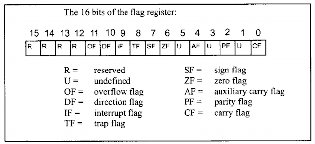

# Notes
64-bit registers start with R
32-bit registers start with E
16-bit registers have two letter names

# Register Types
General Registers - data registers (eax, ebx, ecx, edx), pointer registers(eip, esp, ebp), index registers(si, di)

Control Registers - instruction registers & flag registers

# Data Registers
EAX - 32-bit accumulator
EBX - 32-bit base 
ECX - 32-bit counter 
EDX - 32-bit data 

# Flag Registers
The flag register is a big 32-bit/16-bit register where each byte stores some state

Many instructions use the flag register to store the result value of the instruction.
For Example the instructions of arithmetic operations set Zero Flag to 1
if the result is zero

OF - leftmost bit overflow flag
DF - determines left or right direction for moving or comparing string data. 
0 - left to right 1 - right to left
IF - determines if required to process/ignore external interrupts 
0 - ignore 1 - process
TF - trap flag, for debug purposes sets processor to single-step mode
SF - sign flag, shows the sign of the result of an arithmetic operation.
0 - positive, 1 - negative 
ZF - zero flag, indicates the result of an arithmetic  or comparison operation.
Nonzero result sets flag to 0, zero result - 1
AF - auxiliary carry flag, carry flag from bit 3 to bit 4. For specialized arithmetics
PF - parity flag, sets to 1 if the result of an arithmetic operation has even number of 1-bits, odd result sets to 0
CF - carry flag, contains carry of 0 or 1 from a leftmost after arithmetic operation.
Also stores the contents of last bit of a shift or rotate operation

# Pointer Registers
EIP - 32-bit instruction pointer
ESP - 32-bit stack pointer
EBP - 32-bit base pointer

# Index Registers
ESI - 32-bit source index pointer
EDI - 32-bit destination index pointer

# Segments 
Code segment - contains all the instructions for execution
Data segment - contains data, constants, work areas
Stack segment - contains data, return addresses of processes/subroutines.
Implemented as a 'stack' data structure (Last In First Out)

_Extra segments_
ES, FS, GS - additional segments for storing data

All memory locations within a segment are relative to the starting
address of the segment. A segment begins in an address evenly divisible
by 16 or hexadecimal 10. So the rightmost hex digit in all such memory
addresses is 0, which is not generally stored in the segment registers

_The segment registers store the starting point of a segment. To get the
exact location of data or instruction within a instruction - an offset value is required_
To reference any memory location in a segment, the processor combines the segment
address in the segment register with the offset value of the location

# Segment Registers
CS - 16-bit code segment register, stores the starting address of the code segment
DS - 16-bit data segment register, stores the starting address of the data segment
SS - 16-bit stack segment register, stores the starting address of the stack segment

# Sections 
section .data - initialized data section, (for constant variables)
section .bss - (block starting symbol) unitialized data section, (for non-constant variables)
section .text - code segment, requires 'global _start' inside

